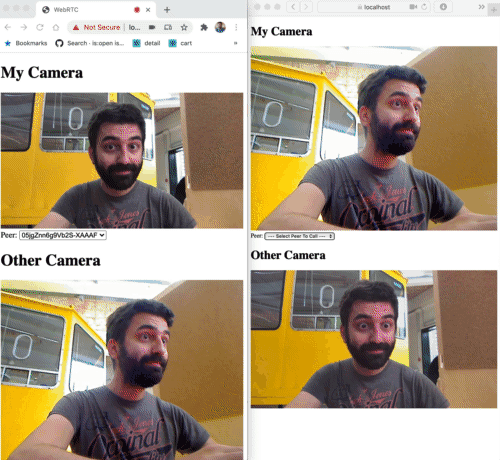

# Communication

In this chapter we're going to cover real-time communication. We'll transfer data between different devices using websockets and will setup audio and video calls using WebRTC.

There are walk-through videos available on our Canvas Learning Platform where we go through this material & exercises step-by-step.

# Websockets

Up until today, you've been writing javascript applications which have been executing mostly on the client. If you wanted to load data from a server, you would use a `fetch` call, wait for an answer from the server and handle the server's response. 

But what if you wanted to get real-time data? An endless loop of fetches doesn't seem such a good idea performance-wise. Luckely, there is a way to keep an open connection and receive new data in our app as soon as it's available: (web)sockets.

(Web)sockets will allow us synchronize data / variables in real time between multiple clients connected to a central server. This data could be anything: text messages for a chat application, mouse positions for a collaborative drawing app or the position of a player in a multi-user game.

Most programming languages have built-in support for sockets. This way, you can link multiple programs and systems to eachother. Now, a socket connection is just one part of the picture, the programs must conform to a given set of rules: a protocol. When you write your own software, you can make this up yourself or use an existing protocol.

In javascript land, we will use Websockets. There have been a couple of versions of the Websocket protocol, but luckely you don't really have to worry about this, as this will be handled by the browser and the socket library you'll be using. Once the connection is made, it's up to you to decide on the format you want to use for data transfer. A logical choice would be sending JSON formatted messages back and forth.

You've probably already used web apps who are working with websockets: Facebook chat, Slack, a live reload server or a browser experience you control using your smartphone.


Make sure to [bookmark the MDN documentation on Websockets](https://developer.mozilla.org/en-US/docs/Web/API/WebSocket).

## Getting real time crypto trades

As a first exercise we'll connect to an existing websocket service. Take a look at [the implementation using AJAX calls](projects/websockets/p01-bitstamp-ajax).

Every 10 seconds, this page will do an AJAX fetch to get the latest transaction from bitstamp:

```javascript
const poll = async () => {
  const data = await (await fetch(apiUrl)).json();
  $h1.innerHTML = `1 BTC = ${data.bpi.EUR.rate} EUR`;
  setTimeout(() => poll(), 10000);
};
```

There are a couple of problems with this implementation:

1. You might miss on transactions if multiple transations happen within that 10 second timeframe
2. You might do unnecessary calls to bitstamp when no transations happened.

Let's improve this with websockets! Note: we can switch to websockets in this particular example as Bitstamp offers a websocket service. Not all apis offer a websocket implementation.

First of all, you'll need to make a websocket connection to bitstamp:

```javascript
const webSocketUrl = `wss://ws.bitstamp.net`;
const socket = new WebSocket(webSocketUrl);
```

Once a connection is made, Bitstamp expects you to send a "subscription" message to their websocket service. You can [read more about their api in the bitstamp docs](https://www.bitstamp.net/websocket/v2/).

You'll need to detect 2 things on this websocket object:

1. Detect when the connection is opened
2. Detect incoming messages

Try [finding out on the MDN Websocket docs](https://developer.mozilla.org/en-US/docs/Web/API/WebSocket) how you can do this by yourself, before continuing with this exercise.

### Detecting a connection

You're able to detect a connection, using the "open" event:

```javascript
socket.addEventListener(`open`, event => {
  console.log(`Socket open`);
}
```

Within that open handler, you'll send the subscription message to bitstamp:

```javascript
const msg = {
  event: "bts:subscribe",
  data: {
    channel: "live_trades_btcusd"
  }
};
socket.send(JSON.stringify(msg));
```

### Listening for incoming data

You'll need to listen for incoming data as well, in order to visualize the trades.

Listen for message events on the socket and parse the incoming string:

```javascript
socket.addEventListener(`message`, event => {
  const data = JSON.parse(event.data);
});
```

Log the data object and explore how you can display the latest trade info on the page. If you're stuck, you can [look at the solution](projects/websockets/p02-bitstamp-websockets) to compare 🙂.

## Building a chat app

We'll be using the [socket.io](https://socket.io) library on both our client and nodejs server. There are a couple of benefits in using socket.io:

- it handles serialization and deserialization, no need to do JSON encodes / decodes yourself.
- you can send different "message types" aka "events" between server and client. Native websockets just have "message" events where you need to add your own protocol to send different kinds of messages.
- it has concepts such as rooms and namespaces to group connections together

As a first exercise with socket.io, we'll build a basic chat application.

### Express

We'll use the express application framework as a basis of our nodejs server. Create a new project folder, and add the express framework to it's dependencies:

```bash
npm init -y
npm install express
```

Create an index.js file in the project root, where you start a basic express server:

```javascript
const express = require('express');
const app = express();
const server = require('http').Server(app);
const port = process.env.PORT || 80;

server.listen(port, () => {
 console.log(`App listening on port ${port}!`);
});
```

Add a start script to your package.json which executes the index.js file

```json
"scripts": {
  "start": "node index.js"
},
```

And run `npm start` to launch the node app. Navigating to http://localhost should give you a 404-error from express:


So, how can you host files from your express app? If you [take a look at the docs](https://expressjs.com/en/starter/static-files.html) you'll see that there is an `express.static(root, [options])` middleware you can use.

Create a folder called `public` in your project root, and link the middleware to your express instance:

```javascript
app.use(express.static('public'));
```

Inside that public folder, you'll create an index.html file. Just leave it empty for now and restart the node server. You should be able to see your html file when navigating to http://localhost

### Listening for websocket connections

Next up, we'll need to handle websocket connections to our server. Add socket.io as a dependency to your project:

```
npm install socket.io
```

Initialise socket.io and pass in the express server:

```javascript
const io = require('socket.io')(server);
```

Next up, add an event listener to handle websocket connections:

```javascript
io.on('connection', socket => {
  console.log('connection');
}); 
```

### Creating a socket.io connection on the client

Back to our HTML. Create a basic form, and load the socket.io library:

```html
<form id="msgForm" method="post" action="">
  <input id="msgInput" type="text" name="msgInput" />
  <button type="submit">Send Message</button>
</form>
<script src="/socket.io/socket.io.js"></script>
```

Create variables to hold the form, input and the socket connections, and provide an `init()` function (empty for now):

```javascript
const msgForm = document.querySelector(`#msgForm`);
const msgInput = document.querySelector(`#msgInput`);

let socket; // will be assigned a value later

const init = () => {

};
init();
```

In this init function, you'll connect to the server. You can just use a forward slash, as our socket server address is the same as our web server domain.

```javascript
socket = io.connect(`/`);
socket.on(`connect`, () => {
  console.log(`Connected: ${socket.id}`);
});
```

Test the app. You should see the "connected" message in your javascript Console.

### Listening for messages on the server

Once we've got a connection set up, we want to send messages between the clients and the server.

Let's listen for `message` events on our server and log them:

```javascript
io.on('connection', socket => {
  console.log(`Connection`);
  socket.on(`message`, message => {
    console.log(`Received message: ${message}`);
  });
});
```

### Sending messages to the server

Next up, we'll use the form to send a message to the server. Listen for the "submit" event on the form:

```javascript
msgForm.addEventListener(`submit`, e => handleSubmit(e));
```

and in the submit handler, you'll send a message with the socket. If everything works as it should, you should see your messages appear in the server console!

```javascript
const handleSubmit = e => {
  e.preventDefault();
  if (socket.connected) {
    socket.emit(`message`, msgInput.value);
  }
  msgInput.value = ``;
};
```

### Forwarding messages

The server needs to forward the message from a client to all connected clients. This way you can display everybody's messages in your app.


There's an easy way to do this in socket.io: using `io.sockets.emit()` you can broadcast a message to everyone. (Check out the [socket.io emit cheat sheet for other options](https://socket.io/docs/emit-cheatsheet/)) Use the same event type as a first parameter, and pass in the incoming message object:

```javascript
socket.on(`message`, message => {
  console.log(`Received message: ${message}`);
  io.sockets.emit(`message`, message);
});
```


### Handling messages from the server

In our client code, we'll need to listen for these message events on your socket object. Hook up an event listener in your `init()` function:

```javascript
socket.on(`message`, message => {
  console.log(`Received message: ${message}`);
});
```

Note that this code is identical to the code you had on the server!

Test the app again. You should see all's messages appear in your console.

Finally: add a textarea to the page and append the incoming messages to the textarea. This way you don't need to have your devtools open, which is more useful for an end user 😉. You can [take a peek at the solution](projects/websockets/p03-simple-chat) if you're stuck.

If you open up a second browser window, you should see the messages from one window appear in all windows. As a final test, you can try connecting to the server from another device on the same WiFi: use your ip-address instead of localhost. Use <kbd>option</kbd> + click on your wifi icon to view your ip address. You might want to disable your firewall in your Security & Privacy settings.

Note that the `message` event type is something we chose ourselves. In your own apps, you can choose whichever event type you like (except from some built in types such as `connect`, `ping`, `pong`, ...)

## Chat app with nicknames

All our messages in the previous app are anomymous. Let's require our users to enter a unique nickname as well.

Next to the `message` event from the previous project, we'll add a second socket.io event `name` to send our name over.

Add a second form to the app to enter a name:

```html
<form id="nameForm" method="post" action="">
  <input id="nameInput" type="text" name="nameInput" placeholder="your name" />
  <button type="submit">Connect</button>
</form>
```

Get a reference to this form and add a listener for the submit event:

```javascript
// add this to the top
const $nameForm = document.getElementById('nameForm');

// ...

// listen for the submit event in the init function
$nameForm.addEventListener('submit', e => handleSubmitName(e));

// ...

// and send the name over in the submit handler
const handleSubmitName = e => {
  e.preventDefault();
  socket.emit('name', $nameInput.value);
};
```

### Linking a name to the socket

On the server side, we'll need to link the name to a connected socket. To do so, we'll create a lookup object where we use the socket ids as a key.

Initialize this lookup object at the top level of your nodejs code:

```javascript
const clients = {};
```

When a client connects, create a value in this lookup object for the given socket. You'll do this in the existing `connection` event:

```javascript
io.on('connection', socket => {
  clients[socket.id] = { id: socket.id };

  // ...

}
```

When a `name` event arrives through the socket, store it in the lookup object:

```javascript
socket.on('name', name => {
  console.log('name', name);
  // TODO: name validation
  clients[socket.id].name = name;
  // send the name back as a confirmation
  socket.emit('name', name);
});
```

Update the message event handler so that every time a message arrives, we send the metadata of the sender when forwarding the message:

```javascript
socket.on('message', message => {
  if (!clients[socket.id].name) {
    // no name? no forward!
    return;
  }
  console.log('message', message);
  io.sockets.emit(`message`, clients[socket.id], message);
});
```

Finally, make sure to delete the client data from the lookup object, when the socket disconnects:

```javascript
socket.on('disconnect', () => {
  delete clients[socket.id];
};
```

### Finalizing the client app

Right now, our client app is broken. After entering a name, we can send a message. However: we're no longer seeing the messages, but `[Object object]` instead.

Try to figure out what's going on by using your console.log skills and looking at the modified server code.

You might have noticed that we're getting two parameters on the message event: the associated client data AND the message. Modify your code, so you're seeing the name of the sender as well:

```javascript
socket.on('message', (sender, message) => {
  console.log(`<${sender.name}> ${message}`);
  $messages.value += `<${sender.name}> ${message}\n`;
});
```

There are still a couple of opportunities to improve the app:

- Validation of the name on the server side: it needs to be a string with at least one character AND needs to be unique
- Two screen ui: show the name input on startup and show the chat screen after validating your name on the server.

As always, you can [look at the solution for inspiration](projects/websockets/p04-chat-with-names).

## Shared cursors app

Real-time shared data can be more than chat messages. In our next app, we'll be sharing our cursor coordinates through a websocket server.


### Writing the server

First up is writing the server.

Create a new node project, with express and socket.io. Host a static directory, with an index.html file. We'll implement this file in a later step.

Our server will do a little more than just forwarding messages. It will keep track of some state data: the x and y positions of each connected client.

In the server app, you'll store the x and y positions per connected client in a global object. Create a global variable to store this information:

```javascript
const clients = {};
```

Every time a client connects, you'll add information to this clients object for that client's socket id:

```javascript
clients[socket.id] = {
  id: socket.id,
  x: Math.random(),
  y: Math.random()
};
```

Listen to the update event of that new socket connection, and update the x and y positions to the new positions:

```javascript
socket.on('update', data => {
  clients[socket.id].x = data.x;
  clients[socket.id].y = data.y;
});
```

When a user disconnects, you'll need to remove the related data from the global object. This is as easy as using the `delete` keyword:

```javascript
socket.on('disconnect', () => {
  console.log('client disconnected');
  delete clients[socket.id];
});
```

Finally, we'll broadcast the global users object to all connected clients,with a given interval. Start that interval once the server starts, and it should automatically sync the users object to all clients:

```javascript
server.listen(port, () => {
 console.log(`App listening on port ${port}!`);
 setInterval(() => {
    io.sockets.emit('update', users);
  }, 100);
});
```

### Shared cursors client

Up to the html part.

In your `init()` function, create a socket connection and add an event listener to the `mousemove` event:

```javascript
socket = io.connect('/');
window.addEventListener(`mousemove`, e => handleMouseMove(e));
```

In your `handleMouseMove` listener, you'll send an `update` event to the server, with the relative mouse position as it's payload:

```javascript
const handleMouseMove = e => {
  if (socket.connected) {
    socket.emit(`update`, {
      x: e.clientX / window.innerWidth,
      y: e.clientY / window.innerHeight
    });
  }
};
```

The server will broadcast cursor positions to all connected clients. This way, you can visualise them in your own client app.

First of all, add a listener for the `update` event on your socket connection:

```javascript
socket.on(`update`, clients => {
  console.log(clients);
});
```

Reload the browser. You should see an incoming object, containing unique ids and coordinates:

```javascript
{
  Sstf83sdx28FU1ZOAAAA: {
    id: "Sstf83sdx28FU1ZOAAAA"
    x: 0.058486238532110095
    y: 0.4036363636363636
  },
  j2jqcHWkBUnj7OB1AAAF: {
    id: "j2jqcHWkBUnj7OB1AAAF"
    x: 0.9962616822429906
    y: 0.38545454545454544
  }
}
```

We will loop through these users with a `for ... in... ` loop, and move a div-block accordingly. We can use the unique ids as an id for the div-block, and create a new div if it doesn't exist yet:

```javascript
for(let clientId in clients) {
  let $cursor = document.querySelector(`#cursor-${clientId}`);
  if(!$cursor) {
    $cursor = document.createElement(`div`);
    $cursor.classList.add(`cursor`);
    $cursor.setAttribute(`id`, `cursor-${clientId}`);
    document.body.appendChild($cursor);
  }
  $cursor.style.left = `${clients[clientId].x * window.innerWidth}px`;
  $cursor.style.top = `${clients[clientId].y * window.innerHeight}px`;
}
```

Add some basic styling for those cursor divs:

```css
.cursor {
  position: absolute;
  width: 1rem;
  height: 1rem;
  margin-left: -.5rem;
  margin-right: -.5rem;
  background: red;
  border-radius: 50% 50%;
  transition: top .1s, left .1s;
}
```

Test the app. You should see red circles move accross the screen!

### Removing old cursors

Right now, when a client disconnect, it's cursor will remain on your screen. You'll need to remove that div from the DOM.

In the `update` event, you'll only get the connected clients. By comparing the list of ids with the previous list of ids, you can check which clients are no longer present.

First of all, create a global variable called `socketIds`. Initialize it as an empty Array:

```javascript
let socketIds = [];
```

In the update handler, store the new socket ids in a const. You can get the keys from the `clients` object, by using the `Object.keys(...)` method:

```javascript
const currentSocketIds = Object.keys(clients);
```

Get a list of the disconnected clients, by filtering out the socketIds from the previous update which are not present in the currentSocketIds.

```javascript
const disconnectedSocketIds = socketIds.filter(clientId => {
  return currentSocketIds.indexOf(clientId) === -1;
});
```

Loop through these socket ids, and remove the corresponding div block from the DOM:

```javascript
disconnectedSocketIds.forEach(clientId => {
  const $cursor = document.querySelector(`#${clientId}`);
  if($cursor) {
    $cursor.parentNode.removeChild($cursor);
  }
});
```

Finally, set the global `socketIds` variable equal to the `currentSocketIds` so you can compare them in the next call.

```javascript
socketIds = currentSocketIds;
```

Test the app, using multiple windows. When you close a window, it's corresponding cursor should disappear from your other windows.

## One to one communcation

One of the applications of websockets, is using your smartphone as an extra input control of a web experience. For this to work, you need to set up a communication channel between the smartphone, server and your desktop browser.

Instead of a server which broadcasts messages to all connected clients, the server will need to messages it receives from your smartphone to your smartphone. For this to work, your smartphone and desktop apps need to know eachother's socket ids.


### Communication structure

We'll have two different apps:

1. A desktop app, connecting to the server
2. A mobile app, connecting to the server, with knowledge of the desktop id

When starting up the mobile part, we'll need to input the desktop id some how. As a quick and easy way, we'll pass the desktop id in the querystring of the mobile page:

| **Desktop**        | **Remote**                 |
|--------------------|----------------------------|
| index.html         | controller.html?id=abc123  |
| socket ID: abc123  | socket ID: xyz987          |

With every message of our remote to the server, we will pass the socket id of the corresponding desktop app as well.

### Server app

Create new Express + socket.io server project, with a static directory for your html files.

This will be a pretty basic socket server, which will send update events to a target user. In the previous app, our message handlers received a message type and a payload (e.g. `update` and `data`). This server app will expect an additional parameter, the target socket id. This is used to forward the incoming payload to just one target socket id (instead of broadcasting it to all sockets).

```javascript
const users = {};

io.on('connection', socket => {
  console.log(`Connection`);
  users[socket.id] = {
    id: socket.id
  };
  socket.on('update', (targetSocketId, data) => {
    if (!users[targetSocketId]) {
      return; // do nothing
    }
    // forward the update to that particular user
    socket.to(targetSocketId).emit('update', data);
  });
  socket.on('disconnect', () => {
    console.log('client disconnected');
    delete users[socket.id];
  });  
});
```

### Desktop client

The desktop page will show a ball, which we'll control using a seperate controller client. We will send update events with x and y coordinates.

Create a new html page, with one div, with class `cursor` (cfr previous exercise). We'll just show this one cursor, no other clients (because we are building a one-to-one application).

Listen for the `update` event, and adjust the position of the `cursor` based on the incoming data:

```javascript
socket.on(`update`, (data) => {
  $cursor.style.left = `${data.x * window.innerWidth}px`;
  $cursor.style.top = `${data.y * window.innerHeight}px`;
});
```

To make things a little easier for the next app we'll build (the controller), we'll display the socket id on the page as wel. Add a DOM element to the page, reference it in your javascript code, and display the url with socket id for the controller, when the socket connects:

```javascript
socket.on(`connect`, () => {
  let url = `${new URL(`/controller.html?id=${socket.id}`, window.location)}`;
  $url.textContent = url;
});
```

### Controller client

Create a second html page. This page expects the target socket id (aka a socket id of a desktop page) to be in the querystring. We will check for this first:

```javascript
let socket, targetSocketId;

const init = () => {
  targetSocketId = getUrlParameter(`id`);
  if (!targetSocketId) {
    alert(`Missing target ID in querystring`);
    return;
  }
};

const getUrlParameter = name => {
  name = name.replace(/[\[]/, '\\[').replace(/[\]]/, '\\]');
  const regex = new RegExp('[\\?&]' + name + '=([^&#]*)');
  const results = regex.exec(location.search);
  return results === null ? false : decodeURIComponent(results[1].replace(/\+/g, ' '));
};

init();
```

Create a socket connection at the end of the init function. Listen for a `mousemove` and / or `touchmove` event on the window object, and send the event object's coordinates to the server, including the targetSocketId:

```javascript
window.addEventListener(`mousemove`, e => {
  socket.emit(`update`, targetSocketId, {
    x: e.clientX / window.innerWidth,
    y: e.clientY / window.innerHeight
  });
});
window.addEventListener(`touchmove`, e => {
  socket.emit(`update`, targetSocketId, {
    x: e.touches[0].clientX / window.innerWidth,
    y: e.touches[0].clientY / window.innerHeight
  });
});
```

Open the desktop page in one window and the controller page in another window. Make sure to include the id displayed in the desktop page in the querystring. You should be able to move the cursor from the controller page.

If you want to test control from an external device, you'll need to connect with the IP address of your server. E.g. http://192.168.0.100:8080/controller.html?id=C4wHK_3R27HtDpjDAAAA

### QR Code

Typing the entire URL, including the id is a bit annoying on a smartphone. In this case, scanning a QR code might be a bit easier.

Include the [qrcode-generator](https://github.com/kazuhikoarase/qrcode-generator) library in your desktop.html:

```html
<script src="https://cdnjs.cloudflare.com/ajax/libs/qrcode-generator/1.4.4/qrcode.min.js"></script>
```

Add a div which will contain the qr code:

```html
<div id="qr"></div>
```

When the socket connects, we'll show the URL with a QR code:

```javascript
const typeNumber = 4;
const errorCorrectionLevel = 'L';
const qr = qrcode(typeNumber, errorCorrectionLevel);
qr.addData(url);
qr.make();
document.getElementById('qr').innerHTML = qr.createImgTag(4);
```

Load the desktop page. Make sure to load it with your computer's ip address (instead of localhost), that way the QR code will contain the ip address in it's url.

## Where to go from here

- Try building a link between an arcade javascript game and your smartphone as controller.
- Use your smartphone's [gyroscope as an input](https://developer.mozilla.org/en-US/docs/Web/API/DeviceOrientationEvent).
- Try integrating Arduino / Johnny five in this setup. Control hardware from your phone?

# WebRTC

As you can read on https://developer.mozilla.org/en-US/docs/Web/API/WebRTC_API:

> **WebRTC** (Web Real-Time Communications) is a technology which enables Web applications and sites to capture and optionally stream audio and/or video media, as well as to exchange arbitrary data between browsers without requiring an intermediary. The set of standards that comprise WebRTC makes it possible to share data and perform teleconferencing peer-to-peer, without requiring that the user installs plug-ins or any other third-party software.

## Accessing your webcam from javascript

Create a new project, with an express server and a static public folder. Inside of the folder, you'll create an index.html and a video tag.

```html
<!DOCTYPE html>
<html lang="en">
<head>
  <meta charset="UTF-8">
  <meta name="viewport" content="width=device-width, initial-scale=1.0">
  <meta http-equiv="X-UA-Compatible" content="ie=edge">
  <title>Webcam</title>
</head>
<body>
  <video id="video" autoplay playsinline></video>
</body>
</html>
```

The API call we will use to access the webcam is [MediaDevices.getUserMedia()](https://developer.mozilla.org/en-US/docs/Web/API/MediaDevices/getUserMedia). 

Let's show our webcam stream in the video tag:

```javascript
const $video = document.getElementById('video');

const init = async () => {
  const constraints = {
    audio: false,
    video: true
  };
  const stream = await navigator.mediaDevices.getUserMedia(constraints);
  $video.srcObject = stream;
};

init();
```

Test the app, you should see your webcam feed in the browser.
[Read up upon the constraints option](https://developer.mozilla.org/en-US/docs/Web/API/MediaDevices/getUserMedia#Parameters) - which allows you to specify preferred resolutions and cameras.

### Security

Viewing the app through localhost works like a charm. However, if you try accessing the page through your ip address, it won't work:

> (index):21 Uncaught (in promise) TypeError: Cannot read property 'getUserMedia' of undefined

Webcam access is disabled on non-secure (aka non-https) origins. If you'd want to test your app on your smartphone, accessing it through your laptop's ip address, you'll need to run an http***s*** server.

First of all, you'll need to [create a self-signed SSL certificate](https://letsencrypt.org/docs/certificates-for-localhost/#making-and-trusting-your-own-certificates). Open up a terminal, navigate to your project root and execute the command below to create a certificate with accompanying private key.

```bash
openssl req -x509 -out localhost.crt -keyout localhost.key \
  -newkey rsa:2048 -nodes -sha256 \
  -subj '/CN=localhost' -extensions EXT -config <( \
   printf "[dn]\nCN=localhost\n[req]\ndistinguished_name = dn\n[EXT]\nsubjectAltName=DNS:localhost\nkeyUsage=digitalSignature\nextendedKeyUsage=serverAuth")
```

Update the server initialization code to use the SSL certificate:

```javascript
const fs = require('fs');
const options = {
  key: fs.readFileSync('./localhost.key'),
  cert: fs.readFileSync('./localhost.cert')
};
const server = require('https').Server(options, app); // httpS instead of http
```

Start the server and test the app through the IP address and https (e.g https://172.20.64.105:8080/). You should see a warning message (screenshot from Google Chrome):


Click "Advanced"... and choose to proceed to the page. You should be able to access the webcam now.

Try accessing it on your smartphone, through the IP address. See if you can force the webcam to use the front or back facing camera of your phone, by setting the constraints in the code.

### Deploying the app

When deploying the app, you'll probably have https running on your server already. In that scenario, you don't need to load the SSL certificate in your code.

To differentiate between development (local) and production (online), you can create a .env settings file where you set your NODE_ENV to development:

```
NODE_ENV=development
```

Add the `node-env` npm package to your project to load this file:

```bash
npm install node-env --save
```

And load the file on the very first line of the server's nodejs logic:

```javascript
require('dotenv').config();
```

Create a boolean where you check if you're running in development or production mode:

```javascript
const isDevelopment = (process.env.NODE_ENV === 'development');
```

and use that boolean check to tweak the server startup:

```javascript
let options = {};
if (isDevelopment) {
  options = {
    key: fs.readFileSync('./localhost.key'),
    cert: fs.readFileSync('./localhost.crt')
  };
}

const server = require(isDevelopment ? 'https' : 'http').Server(options, app);
```

Note that it'll use `http` in production mode: on servers like heroku, SSL termination is done on Heroku servers/load-balancers before the traffic gets to your application.

Finally, make sure to have the .env file and certificate files in a .gitignore:

```
*.crt
*.key
.env
```

Test deployment of your app to an online server, e.g. heroku.

## Peer to peer media streaming

What if we want to send our webcam feed to another computer over the internet? We will need to make sure the two computers know how to connect to eachother, what video codecs they support and open a communication channel to stream the data to one another.

First of all, [read through "Lifetime of a WebRTC session](https://developer.mozilla.org/en-US/docs/Web/API/WebRTC_API/Session_lifetime#Establishing_a_connection) to familiarize yourself with a couple of concepts and how a WebRTC session is set up.

### Creating a signalling server

Crucial to WebRTC peer to peer communication is a signalling service. We'll build this using socket.io.

This server needs to facilitate 3 types of messages:

1. Sending an offer from client A to client B
2. Sending an answer to an offer from client B back to client A
3. Sending ice candidate information between both clients

Duplicate the previous project where you had a basic https express server. Add socket.io to the project, and setup these 3 different message types.

```javascript
const clients = {};
io.on('connection', socket => {
  clients[socket.id] = { id: socket.id };

  socket.on('disconnect', () => {
    delete clients[socket.id];
    io.emit('clients', clients);
  });

  socket.on('peerOffer', (peerId, offer) => {
    console.log(`Received peerOffer from ${socket.id} to ${peerId}`);
    io.to(peerId).emit('peerOffer', peerId, offer, socket.id);
  });

  socket.on('peerAnswer', (peerId, answer) => {
    console.log(`Received peerAnswer from ${socket.id} to ${peerId}`);
    io.to(peerId).emit('peerAnswer', peerId, answer, socket.id);
  });

  socket.on('peerIce', (peerId, candidate) => {
    console.log(`Received peerIce from ${socket.id} to ${peerId}`);
    io.to(peerId).emit('peerIce', peerId, candidate, socket.id);
  });

  io.emit('clients', clients);

});
```

Note that there's also logic in place to manage all connected clients in a lookup object and broadcasts of all clients happens when connecting and disconnecting (the `io.emit('clients', clients);` calls).

### Connecting to the signalling server

As a first exploration of WebRTC, we'll be working with a sender app and a receiver app.

The sender app will have the logic to reach out to another connected client (receiver) to setup a call. The receiver app will answer an incoming call.

### Sender application

Create a `sender.html` in the public folder:

```html
<!DOCTYPE html>
<html lang="en">
<head>
  <meta charset="UTF-8">
  <meta name="viewport" content="width=device-width, initial-scale=1.0">
  <title>WebRTC</title>
  <style>
    video {
      max-width: 100%;
      height: auto;
    }
  </style>
</head>
<body>
  <h1>Sender</h1>
  <video id="myCamera" playsinline autoplay muted></video>
  <label for="peerSelect">Peer: </label><select id="peerSelect"></select>

  <script src="/socket.io/socket.io.js"></script>
  <script type="module">

    const $myCamera = document.getElementById('myCamera');
    const $peerSelect = document.getElementById('peerSelect');

    let socket;
    let myStream;
    let peerConnection;

    const servers = {
      iceServers: [{
        urls: 'stun:stun.l.google.com:19302'
      }]
    };

    const init = async () => {
      initSocket();
      const constraints = { audio: true, video: { width: 1280, height: 720 } };
      myStream = await navigator.mediaDevices.getUserMedia(constraints);
      $myCamera.srcObject = myStream;
    };

    const initSocket = () => {
      socket = io.connect('/');
      socket.on('connect', () => {
        console.log(socket.id);
      });
    };

    init();

  </script>
</body>
</html>
```

Make sure the server is running and open up https://localhost/sender.html. You should see your webcam, and in the devtools console your socket id should appear.

### Display all connected clients

In the select element, the other connected client ids should appear. Selecting a client should initiate a call.

Add a listener for the `clients` event on the socket:

```javascript
socket.on('clients', updatePeerList);
```

Write that updatePeerList function so that:

- You create an option for every client id in the clients object (Hint: use a for...in loop). Use the client's id as the value AND the label for each option.
- Don't create an option for your own socket id (Hint: compare socket.id with the client's id)
- Create an option with an empty value, with the text "Select Peer To Call"
- Add an event listener to the `input` event of the select box
- In the event handler you'll log the value of the select

Try coming up with the solution yourself before looking at a possible implementation below. Test the application with at least two browser windows, so you'll see the other socket / client ids.

```javascript
const updatePeerList = (clients) => {
  $peerSelect.innerHTML = '<option value="none">--- Select Peer To Call ---</option>';
  for (const clientId in clients) {
    const isMyOwnId = (clientId === socket.id);
    if (clients.hasOwnProperty(clientId) && !isMyOwnId) {
      const client = clients[clientId];
      const $option = document.createElement('option');
      $option.value = clientId;
      $option.textContent = clientId;
      $peerSelect.appendChild($option);
    }
  }
};
```

```javascript
// somewhere in your init function
$peerSelect.addEventListener('input', callSelectedPeer);
```

```javascript
const callSelectedPeer = () => {
  console.log('call selected peer', $peerSelect.value);
};
```

### Initiating the call

When we select an other client, we should:

- Create an RTCPeerConnection
- Create an "offer"
- Send that offer over the websocket server (aka the signalling server)

Create a new function `callPeer`, which takes a peer id (aka socket id) as a parameter:

```javascript
const callPeer = (peerId) => {
  peerConnection = new RTCPeerConnection(servers);
};
```

You can create an offer using the `.createOffer()` method on an RTCPeerconnection instance. [Take a look at the docs of the createOffer method](https://developer.mozilla.org/en-US/docs/Web/API/RTCPeerConnection/createOffer). You'll see that it returns a promise:

> _aPromise = myPeerConnection.createOffer([options]);_

In order to "await" this promise to resolve, you'll need to set the callPeer method as async:

```javascript
const callPeer = async (peerId) => {
```

In the callPeer method, you can now create the offer, link it as the local description of the connection and send it over the websocket connection, through the server, to the other client:

```javascript
const offer = await peerConnection.createOffer();
await peerConnection.setLocalDescription(offer);
socket.emit('peerOffer', peerId, offer);
```

Finally, make sure to execute the callPeer method from the selection input handler:

```javascript
const callSelectedPeer = async () => {
  console.log('call selected peer', $peerSelect.value);
  callPeer($peerSelect.value);
};
```

Test the app with two windows and select a socket id from the selection list. You should see the peerOffer appear in the server console.

### Answer the call

We'll now start our receiver app. Create a new html file called `receiver.html`:

```html
<!DOCTYPE html>
<html lang="en">
<head>
  <meta charset="UTF-8">
  <meta name="viewport" content="width=device-width, initial-scale=1.0">
  <title>WebRTC</title>
  <style>
    video {
      max-width: 100%;
      height: auto;
    }
  </style>
</head>
<body>
  <h1>Receiver</h1>
  <video id="otherCamera" playsinline autoplay muted></video>
  <script src="/socket.io/socket.io.js"></script>
  <script type="module">

    const $otherCamera = document.getElementById('otherCamera');

    let socket;
    let peerConnection;

    const servers = {
      iceServers: [{
        urls: `stun:stun.l.google.com:19302`
      }]
    };

    const init = async () => {
      initSocket();
    };

    const initSocket = () => {
      socket = io.connect(`/`);
      socket.on(`connect`, () => {
        console.log(socket.id);
      });
    };

    init();

  </script>
</body>
</html>
```

Listen for the `peerOffer` event on the socket instance:

```javascript
socket.on('peerOffer', (myId, offer, peerId) => {
  console.log(`Received peerOffer from ${peerId}`);
});
```

Open the `sender.html` in one browser window and the `receiver.html` in another window. When selecting the socket id in the sender, you should see the "received peerOffer" log appear in the receiver.html

Create a new method `answerPeerOffer` where you initiate the peerConnection. Make it async, as we'll use promise based calls:

```javascript
const answerPeerOffer = async (myId, offer, peerId) => {
  peerConnection = new RTCPeerConnection(servers);
};
```

Here the order is a little bit different than on the sender side. First of all, you'll need to set the "remote description" to be the incoming offer:

```javascript
await peerConnection.setRemoteDescription(offer);
```

then you'll need to create the answer and set that as the local description:

```javascript
const answer = await peerConnection.createAnswer();
await peerConnection.setLocalDescription(answer);
```

and finally you'll need to send this answer over the socket to the sender:

```javascript
socket.emit(`peerAnswer`, peerId, answer);
```

Make sure to call the `answerPeerOffer` method from the `peerOffer` socket event handler:

```javascript
socket.on('peerOffer', (myId, offer, peerId) => {
  console.log(`Received peerOffer from ${peerId}`);
  answerPeerOffer(myId, offer, peerId);
});
```

Test the app again with `sender.html` and `receiver.html`. When initiating a call using the select box, you should see the offer appear in the receiver and the answer to the offer back in the sender.

### Adding the streaming logic

To send a video / audio stream between the two peers, we'll need to do a few more things. The first thing is to make sure the ICE candidate information is sent between the two parties.

Both `sender.html` and `receiver.html` need to listen for ice candidates on the peerConnection. Add this logic right after you created the peerConnection instance:

```javascript
peerConnection.onicecandidate = (e) => {
  console.log('ice candidate', e.candidate);
  socket.emit('peerIce', peerId, e.candidate);
};
```

Handle the incoming `peerIce` events on the socket instance (again in both the `sender.html` and `receiver.html`):

```javascript
socket.on('peerIce', async (myId, candidate, peerId) => {
  console.log(`Received peerIce from ${peerId}`, candidate);
  await handlePeerIce(myId, candidate, peerId);
});
```

The handlePeerIce function should add the incoming candidate to the RTCPeerConnection instance:

```javascript
const handlePeerIce = async (myId, candidate, peerId) => {
  if (!candidate) {
    return;
  }
  await peerConnection.addIceCandidate(candidate);
};
```

We're almost there. In the `sender.html` we need to add our video stream tracks to the RTCPeerConnection instance. You can do this right after linking the `onicecandidate` callback:

```javascript
// add the video stream
for (const track of myStream.getTracks()) {
  peerConnection.addTrack(track, myStream);
}
```

In `receiver.html` we can listen for incoming tracks using the `ontrack` callback on the RTCPeerConnection instance. Add this right after linking the `onicecandidate` callback:

```javascript
peerConnection.ontrack = (e) => {
  console.log('ontrack');
  $otherCamera.srcObject = e.streams[0];
};
```

Test the app. Depending on your browser you should see the stream playing in the receiver.html, or the first frame. In Safari, you might need a user interaction before the video starts playing. You can solve this using a simple click handler on the video tag of the `receiver.html`:

```javascript
$otherCamera.addEventListener('click', () => {
  $otherCamera.play();
});
```

Don't only test on one device, but try sending the camera stream of your mobile phone over to your computer! Open the `sender.html` on your phone and `receiver.html` on your computer 🤓.

## Simple Peer Framework

As you've experienced there's quite a bit of code needed to get the communication set up. There are also quite some possible pitfalls: get the communication order wrong and the entire call might fail.

Luckely there are a couple of libraries which take some of this overhead out of our hands. The library we'll be using in this course is [simple-peer](https://github.com/feross/simple-peer).

Simple Peer will manage the RTC Connection and will take care of creating offers, answers, ice candidates and linking streams to the connection. We still need a signalling layer (in our case a socket.io server) to initiate the connetions.

Replace the `peerOffer`, `peerAnswer` and `peerIce` listeners on the server side, with one listener for `signal` events:

```diff
- socket.on('peerOffer', (peerId, offer) => {
-   console.log(`Received peerOffer from ${socket.id} to ${peerId}`);
-   io.to(peerId).emit('peerOffer', peerId, offer, socket.id);
- });
-
- socket.on('peerAnswer', (peerId, answer) => {
-   console.log(`Received peerAnswer from ${socket.id} to ${peerId}`);
-   io.to(peerId).emit('peerAnswer', peerId, answer, socket.id);
- });
- 
- socket.on('peerIce', (peerId, candidate) => {
-   console.log(`Received peerIce from ${socket.id} to ${peerId}`);
-   io.to(peerId).emit('peerIce', peerId, candidate, socket.id);
- });

+ socket.on('signal', (peerId, signal) => {
+   console.log(`Received signal from ${socket.id} to ${peerId}`);
+   io.to(peerId).emit('signal', peerId, signal, socket.id);
+ });
```

That's it for the server side. Let's implement the necessary changes on our client side.

### Simple Peer Client

First things first, we'll do the necessary changes in `sender.html`.

Add a script tag to load simple-peer from a CDN. Make sure to add this before the script tag with your own code:

```html
<script src="https://cdnjs.cloudflare.com/ajax/libs/simple-peer/9.7.2/simplepeer.min.js" integrity="sha512-RZlErEuUwWv3EhGNhvni9vinu0QPwNU0OyWAlhTeezEToTZu/C+/Mn7ItRFmpcf8MTK0J2kRalSfzrpQqF7wJQ==" crossorigin="anonymous"></script>
```

Get rid of the `peerAnswer` and `peerIce` listeners, and add a listener for `signal` events instead:

```javascript
socket.on('signal', async (myId, signal, peerId) => {
  console.log(`Received signal from ${peerId}`);
  console.log(signal);
  peer.signal(signal);
});
```

This will forward an incoming signal from the signalling server to our Simple Peer instance. An incoming signal can be an answer, an ice candidate, ... The Simple Peer instance will handle it from there.

Next up is simplifying our `callPeer` method. Instead of creating an RTCPeerConnection instance with all it's listeners, we'll create a SimplePeer instance:

```javascript
const callPeer = async (peerId) => {
  peer = new SimplePeer({ initiator: true, stream: myStream });
  peer.on('signal', data => {
    socket.emit('signal', peerId, data);
  });
};
```

As you can see, this is a lot less code! Note the `initiator` property: this tells SimplePeer it needs to setup a call offer (not answer one).

You can get rid of the `handlePeerAnswer` and `handlePeerIce` methods as well.

Up to the `sender.html` now. Try implementing the necessary changes there to make the app work again!

Some hints:

1. You'll need to setup the Simple Peer instance when a call signal arrives. Initiator will be false in this instance.

```javascript
if (signal.type === 'offer') {
  answerPeerOffer(myId, signal, peerId);
}
peer.signal(signal);
```

2. You'll need to handle the incoming stream as well:

```javascript
peer.on('stream', stream => {
  $otherCamera.srcObject = stream;
});
```

If you're stuck, you can compare your code with the [solution for this exercise](projects/webrtc/p04-simple-peer)

## Streaming in two directions

Let's merge our two htmls in to one and setup up two-way streaming. Duplicate `sender.html` and rename it to `index.html`. You'll just use this single page.

The Simple Peer instance creation is almost identical for both scenarios. The only difference is the "initiator" property. Rename the `callPeer` method to `createPeer` and pass in the `initiator` boolean as well:

```javascript
const createPeer = (initiator, peerId) => {
  peer = new SimplePeer({ initiator, stream: myStream });
  peer.on('signal', data => {
    socket.emit('signal', peerId, data);
  });
  peer.on('stream', stream => {
    $otherCamera.srcObject = stream;
  });
  peer.on('error', () => {
    console.log('error');
  });
};
```

Try figuring out how have the answering logic in this same html as well. In the end you should be able to open the same index.html in two browser windows, start the call from one window and see the streams in both windows.



Note: I've connected a separate webcam to my machine to demonstrate different video feeds being shared.

Once again, if you're stuck, you can [compare with the solution](projects/webrtc/p05-both-directions)