# Artificial Intelligence

## Intro

- Watch [Coding Train - What is Machine Learning (first 16 min)](https://www.youtube.com/watch?v=LvIa0-ZKCrc&list=PLRqwX-V7Uu6bCN8LKrcMa6zF4FPtXyXYj)

The last decade there's been a lot of buzz around Machine Learning, Artificial Intelligence and Deep learning. The explosion in computer performance, especially with GPUs has enabled new possibilities in making computers seem intelligent.

You'll see the terms Artificial Intelligence, Machine Learning and Deep Learning getting mixed together a lot. They're actually a subset of eachother:

Artificial Intelligence contains Machine Learning, which contains Deep Learning:


Image Source: https://blogs.nvidia.com/blog/2016/07/29/whats-difference-artificial-intelligence-machine-learning-deep-learning-ai/ 

Using Machine Learning, you can make a computer do things, without explicitly programming that task. There are roughly 3 types of tasks which can be executed using Machine Learning:

1. Classification: Label data, based on certain inputs. An example would be OCR: given an image of a letter, predicting which letter it is.
2. Regression: Calculating a single value based on a number of inputs. For example: calculating the price of a house, based on data such as number of bedrooms, square meters, neighbourhood, ...
3. Clustering: Group data together. In contrast with Classification, the groups / labels are not known in advance. An example is analyzing customer behaviour (customers also bought...)

Training the algorithm can happen in different ways:

1. Supervised Learning: An algorithm learns, based on example input data with the correct answers. For example: we give the computer a list of housing data with corresponding prices. Or a list of images of letters, with the corresponding letter label. (this is a letter A, this is a letter B, ...)
2. Unsupervised Learning: The algorithm learns by itself, based on input data. Used mostly with clustering tasks.
3. Reinforcement Learning: The algorithm gets a reward when it performs well, and gets punished when it performs badly. Example would be learning to play a game automatically.

## Neural Networks

A Neural Network is built with different layers of "neurons", who are all connected to eachother. Every connection has a "weight", which affects the influence of a given neuron.


Image Credit: http://cs231n.github.io/neural-networks-1/

A non-trained network will have random weights and won't give you good results. By training a network with example data, you'll tweak the weights little by little, until our network (hopefully) performs well.

## GAN

A Generative Adversial Network (GAN) is a network with two competing entities: a Generator and a Discriminator. The Generator generate samples as real as possible, and tries to fool the Discriminator, who tries to classify between real and fake data.


Image Credit: https://www.freecodecamp.org/news/an-intuitive-introduction-to-generative-adversarial-networks-gans-7a2264a81394/

A popular example of a GAN is https://thispersondoesnotexist.com/ - each time you visit the page, you'll see a photo of a person, entirely generated by a GAN (StyleGAN). Or try detecting which person is real and which person is generated at http://www.whichfaceisreal.com.

# ML5.js

As a first step, we'll use some existing ML models in our browsers, using the [ML5.js library](https://ml5js.org/).

The ML5 library is built on top of Tensorflow.js - making it a bit easier to use machine learning models in your javascript application.

[Explore some of the examples made by Andreas Refsgaard](https://ml5-fellowship-2020.github.io/examples/) to get a grasp of the capabilities of ML5. Note that the examples are using [P5.js](https://p5js.org/) as well, which is a framework for creative coding in javascript. It comes with features to easily setup a a canvas, webcam, load images, draw loop, etc... However, P5 is not a requirement for ML5, you can use ML5 with your vanilla javascript code as well.

There are a few examples available in vanilla javascript as well on [the ml5 repo](https://github.com/ml5js/ml5-library/tree/development/examples/javascript).

A lot of the things we're doing in the course, is based on the [Beginners Guide to Machine Learning in Javascript](https://www.youtube.com/playlist?list=PLRqwX-V7Uu6YPSwT06y_AEYTqIwbeam3y) from [Daniel Shiffman / The Coding Train 🚂](https://www.youtube.com/channel/UCvjgXvBlbQiydffZU7m1_aw). Make sure to watch that particular playlist for a step-by-step, more in-depth explanation of some of the ML5 apps we're building.

## Image Classifier

As a "hello ml5 world" example, we'll try using the Image Classifier. As you can [read on the ml5 imageClassifier docs](https://ml5js.org/reference/api-ImageClassifier/):

> You can use neural networks to recognize the content of images. ml5.imageClassifier() is a method to create an object that classifies an image using a pre-trained model.
>
> It should be noted that the pre-trained model provided by the example below was trained on a database of approximately 15 million images ([ImageNet](http://www.image-net.org/)). The ml5 library accesses this model from the cloud. What the algorithm labels an image is entirely dependent on that training data -- what is included, excluded, and how those images are labeled (or mislabeled).

First of all, create an HTML document, and link the ml5 library:

```html
<script src="https://unpkg.com/ml5@0.5.0/dist/ml5.min.js"></script>
<script>
{
  // our code goes here
}
</script>
```

We'll need to load an image, the easy way to do it, is using a promise based approach with async/await:

```javascript
const loadImage = src=> {
  return new Promise((resolve, reject) => {
    const $img = new Image();
    $img.addEventListener("load", () => resolve($img));
    $img.addEventListener("error", err => reject(err));
    $img.src = src;
  });
};

const init = async () => {
  const $img = await loadImage('images/cat.jpg');
  document.body.appendChild($img);
};

init();
```

Nothing new here. Let's go and add the ml5.imageClassifier, to detect what's displayed in the image.

On the [ml5.imageClassfier docs page](https://ml5js.org/reference/api-ImageClassifier/) you'll read that you can create an instance of the imageClassifier, using `ml5.imageClassifier(model)`. Read about the different parameters on that page - especially the part about the optional callback.

We will used the promise based approach, and "await" for the model to be loaded:

```javascript
const classifier = await ml5.imageClassifier('MobileNet');
console.log('Mobilenet loaded');
```

Run the app, and check the network panel. You'll notice that there's a bunch of extra network requests, which have to do with loading the model. Once the model is fully loaded, you should see the "Mobilenet loaded" message in your console.

Now the final part: detect the contents of the image. [Read about the classify method and all it's options on the ml5 docs](https://ml5js.org/reference/api-ImageClassifier/) and try implementing it, using the async/await syntax. Show the result on the page, underneath the image:


### Video Classifier

When you read  [ml5.imageClassfier docs](https://ml5js.org/reference/api-ImageClassifier/) - you stumbled upon the "video" option: you can pass in a video element when creating the imageClassifier, and do image classification on live video.

1. Create a new html document, and load the ml5 library
2. Display your webcam video feed on the page.
3. Create an imageClassifier instance. Store it in a global variable, and pass in a reference to your video element:

```javascript
classifier = await ml5.imageClassifier('MobileNet', $video);
```

4. Create a separete `loop()` function where you place the `classify()` logic. At the end of that `loop()` function, call `loop()` again, so it keeps classifying:

```javascript
const loop = async () => {
  const results = await classifier.classify($video);
  $label.textContent = `${results[0].label} (Confidence: ${results[0].confidence})`;
  loop();
};
```

Test the app. You might get the following error:

> Unhandled Promise Rejection: Error: Requested texture size [0x0] is invalid.

If you do a Google search on this error, you'll [read on stackoverflow](https://stackoverflow.com/questions/57662313/requested-texture-size-0x0-is-invalid-error-when-i-am-loading-image-in-browse) this has to do with Tensorflow.js determening the size based upon the width and height of the DOM element. However, for a video tag, this is stored in `videoWidth` and `videoHeight`. Make sure to set the width and height of the video element to the videoWidth and videoHeight.

```javascript
$video.width = video.videoWidth;
$video.height = video.videoHeight;
```

You'll get mixed results, depending on if the video is showing something in the ImageNet dataset or not. You'll notice a "low" confidence value when classifying something not quite in the dataset (it guesses I am a mask):


But when showing an image of something in the ImageNet dataset, the confidence is higher (and the classification is more correct:


## Transfer Learning

In a next experiment, we'll use "Transfer Learning" to inject our own, custom training samples in the ImageNet model, and get it to recognize "new" classes of images. A live example of the possibilities of Transfer Learning is [Google's Teachable Machine](https://teachablemachine.withgoogle.com). Play around with this online app to familiarize yourself of the capabilities of this technique.

[We'll use the ml5 featureExtractor](https://ml5js.org/reference/api-FeatureExtractor/) to apply Transfer Learning in our app.

1. Create a new html document, and load the ml5 library
2. Display your webcam video feed on the page.
3. Initialize the featureExtractor:

```javascript
featureExtractor = await ml5.featureExtractor('MobileNet').ready;
```

4. ... and create a classifier, passing in a reference to the video tag:

```javascript
classifier = featureExtractor.classification($video);
```

Note: you might get an error in Safari:

> Unhandled Promise Rejection: TypeError: n.videoElt.captureStream is not a function. (In 'n.videoElt.captureStream()', 'n.videoElt.captureStream' is undefined)

This is because ml5 is trying to get the stream reference using [captureStream](https://developer.mozilla.org/en-US/docs/Web/API/HTMLMediaElement/captureStream) which is not supported by Safari. You can easily polyfill this by defining this function yourself:

```javascript
if (!$video.captureStream) {
  $video.captureStream = () => stream;
}
```

5. Add 3 buttons to the page: a button to classify an image as class "one", a button to classify an image as class "two" and a button to start training. Note that we've specified the classification label as a data attribute `data-label`:

```html
<button id="button1" data-label="one">One</button>
<button id="button2" data-label="two">Two</button>
<button id="trainButton">Train</button>
```

6. Add a click event listener to button1 and button2. The event handler adds a sample to the classifier:

```javascript
const buttonClickHandler = e => {
  const $button = e.currentTarget;
  const label = $button.dataset.label;
  classifier.addImage(label);
};
```

7. Add a click event listener to the training button, in it's event handler you kick off the training process, passing in a progress callback:

```javascript
const trainClickHandler = e => {
  classifier.train(whileTraining);
};

const whileTraining = (loss) => {
  if (loss === null) {
    console.log('Training Complete');
  } else {
    console.log(`Training (loss: ${loss})`);
  }
};
```

8. When training is complete (inside the `whileTraining` function, when loss is equal to null), you can start the same `loop()` logic as in the previous exercise.

Launch the app, and add samples for classification one and classification two. For example: in samples for classification one you are in the frame, and classification two you are outside of the frame. Add at least 15 samples for each scenario, and make sure to move around the frame (when you are in the frame...) to get sufficient different samples. After training, the app should be pretty confident about each scenario.


### Saving / Loading the model state

Having to retrain the model every time you launch the application isn't really practical. Luckely, you can save the state of the model once it's trained, and load that saved state when the application launches.

Add a button to save the model, and link an event handler to the `click` event:

```javascript
const saveClickHandler = e => {
  classifier.save();
};
```

Once the model is trained, click this save button, which will offer you to download a json file and a weights.bin file.

> You should get both files. If you don't, try running this part in Google Chrome.

If you want to use this trained model in your app, it's as simple as calling the `classifier.load` method, passing in the path to the json file. You can do this at startup, right after the classifier is instantiated:

```javascript
await classifier.load('models/piglet/model.json');
loop();
```

### Things to do

Try expanding this application:

- Trigger different sounds, based on the classification
- Replace keyboard input with this classifier to control an arcade game

### Transfer Learning - Regression

Instead of doing classification, we can also use transfer learning to do regression: calculate a single, numerical value based on an input.

1. Remove the 2 buttons from the page. Instead, you'll add a slider and a button to add a sample:

```html
<input id="slider" type="range" min="0" max="1" value="0.5" step="0.1" />
<button id="labelButton">Label</button>
```

2. Create a regressor instead of a classifier:

```javascript
regressor = featureExtractor.regression($video);
```

3. Every time you click the labelButton, you'll add a sample to the regressor. This will tell the regressor to what numerical value the video currently corresponds:

```javascript
const labelClickHandler = e => {
  regressor.addImage(parseFloat($slider.value));
};
```

4. The results structure is a bit different, as we don't have multiple classification labels anymore. Update the `loop()` function to show this value:

```javascript
const results = await regressor.predict($video);
$label.textContent = `${results.value})`;
```


Try to expand on this technique:

- Map the position of a rectangle to the value
- Explore [Tone.js](https://tonejs.github.io) and see how you can map a frequency to the regression value

## KNN Classification

K-Nearest-Neighbour classification is a way to label data, based on the "distance" of that data to known, labeled data.


In the GIF above you can see 2-dimensional data (x and y positions) being mapped to known data, based on the Euclidean distance. You can [test a live version of this at the "How to build a Teachable Machine with TensorFlow.js" page](https://observablehq.com/@nsthorat/how-to-build-a-teachable-machine-with-tensorflow-js#-o-0-nearest-neighbors).

Using this technique, we can map K-dimensional data to their nearest neighbors. Us humans have a difficulty understanding more than 3 or 4 dimensions. However, the math to calculate the distance and the logic to map an unknown datapoint to a class remains the same.

The advantage here is that we won't need a separate training step and can classify (image) data in real time. We can tweak the model while it is running.

Our app will be similar to the previous classification app, except we won't have a training step. So, create a basic app, showing your webcam video stream and 2 buttons we'll press to classify the image:

```html
<body>
  <video id="video" autoplay width="320" height="240"></video>
  <h2 id="label">Loading Webcam...</h2>
  <div>
    <button id="button1" data-label="one">One</button>
    <button id="button2" data-label="two">Two</button>
  </div>
</body>
```

We'll even create the same featureExtraction as in the previous app. However, after initializing it, we'll create a KNNClassifier, instead of a featureExtractor.classification:

```javascript
featureExtractor = await ml5.featureExtractor('MobileNet').ready;
// classifier = featureExtractor.classification($video);
knn = ml5.KNNClassifier();
```

Every time we press one of the classification buttons, we'll add the feature data of the current webcam image to the knn classifier. Note that this is not the full RGB data, but a reduced set of image "features" created by the feature extractor.

First of all, it's interesting to see this feature data:

```javascript
// in the button click handler
const logits = featureExtractor.infer($video);
logits.print();
```

You'll see a "Tensor" being logged in your console:

```json
Tensor
     [[0, 0.275391, 1.4118662, ..., 0.0468513, 0.2281258, 0.1108307],]
```

This Tensor is an internal data structure from [Tensorflow.js](https://www.tensorflow.org/js), the framework ml5.js uses internally.

Now, you'll add this Tensor to the classifier:

```javascript
knn.addExample(logits, label);
```

We'll also setup a loop, where you'll be classifying the image continuously:

```javascript
const loop = async () => {
  if (knn.getNumLabels() > 0) {
    const logits = featureExtractor.infer($video);
    const classification = await knn.classify(logits);
    console.log(classification.label);
  }
  requestAnimationFrame(loop);
};
```

Run the app, and classify your two scenarios. You should be able to add examples while running, and see the model improve in real time.

### Save - Load KNN

Just like before, you can save the model state and load it again, so you don't need to retrain all of the time:

```javascript
// saving the knn model state
knn.save()
```

```javascript
// loading the knn model state
await knn.load('models/knn/myKNN.json')
```

# Exploring models on Google Colab

A lot of the more recent AI models require a beefy nvidia GPU to run. You might not have a GPU that meets that requirement. Luckely, there are cloud options available to run these models on a remote server.

One of the free options to do so is Google Colab. You can create and run Python notebooks from the browser, executing the code on Google's powerful servers.

A good starting point for finding Google Colab notebooks is https://aihub.cloud.google.com/

## Image Classification with Mobilenet

As a first test, we'll run an image classifier, to identify the contents of an image. This might not be the best case to run on a beefy GPU (as mobilenet even has implementations to run in the browser, on mobile phones). However, we'll run into some common Google Colab issues, without spending too much time waiting for code to complete (as executing a mobilenet model doesn't ask much from the system).

Do a search for "label:Classification" on on https://aihub.cloud.google.com/. You should look for the "Mobile Net" notebook. Click on the notebook in the search results](https://aihub.cloud.google.com/u/0/p/products%2Fafc076d6-3017-49b2-a5ee-0af4ba514f53). On the resulting page, you should find a [Run in Google Colab](https://colab.research.google.com/github/tensorflow/models/blob/master/research/slim/nets/mobilenet/mobilenet_example.ipynb) link. Click it to open the notebook in Google Colab.

A Colab notebook is a combination of text and code block. Read through the notebook and, whenever you encounter a code block, run it by clicking on the "play" icon (visible on hover over the square brackets:)

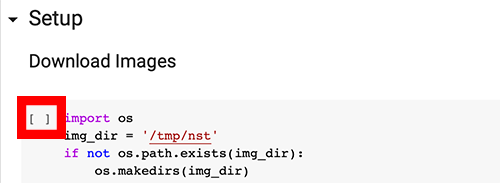

Wait for a block to finish executing before running the next one.

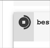

Some blocks finish fast (such as a function definition block), others might take a couple of minutes to finish. Once a block finished, you'll see a number inside the square brackets (or a play icon if that block is still active):

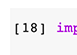

### Error: "ModuleNotFoundError: No module named 'tf_slim'"

In the Checkpoint based inference block, you might run into the following error:

> ModuleNotFoundError: No module named 'tf_slim'

A Google search learns us that 'tf_slim' is not installed by default on Colab and we should install it using `!pip install tf_slim`. We'll execute this command in a new, separate block.

Look for the __+ Code__ button and click it.

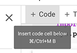

In the new block, put the command you want to execute:

```
!pip install tf_slim
```

Move the block up or down by using the arrow buttons, so that it becomes the first block of the notebook.

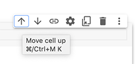

Try running the block again. Another issue arises:

> RuntimeError: tf.placeholder() is not compatible with eager execution.

The reason you're getting this error is that Google Colab is running Tensorflow 2 by default, but the code we are running is Tensorflow 1. We'll need to make sure the runtime uses Tensorflow 1 instead.

Create another code block, and move it to the top of the notebook, right above the tf_slim block we added earlier. In this block, you'll set the Tensorflow version to version 1:

```python
%tensorflow_version 1.x
import tensorflow as tf
print(tf.__version__)
```

Execute that block. If you get the message "TensorFlow is already loaded. Please restart the runtime to change versions.", go to Runtime > Restart Runtime:

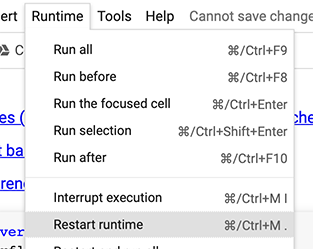

Go through each block again, including our 2 newly added blocks. When executing, the first block should say we're running Tensorflow 1:

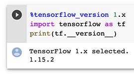

Alas, our python block will throw another error:

> AttributeError: module 'tensorflow._api.v1.compat.v1' has no attribute 'contrib'

There's an easy fix: change the import of tensorflow (the first line of that block):

```diff
- import tensorflow.compat.v1 as tf
+ import tensorflow as tf
```

The blocks should run fine now, and should classify a demo image as a "panda":


### Classify an image of our own

Let's try classifying an image we upload. You could either add a Code Block with a wget command, to fetch an image from a url (which is how the panda.jpg ended up on Colab, try to find the command in the Prerequisites section!).

An alternative is to upload a file through Colab. In the left section of your screen, you'll find a "folder" icon to go to the file explorer.

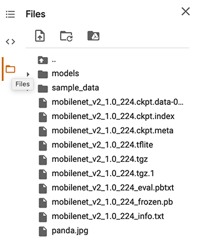

Click the upload icon and upload a jpg of your own. Change the "panda.jpg" mentions in the colab block to the name of your uploaded file and run the classifier again!

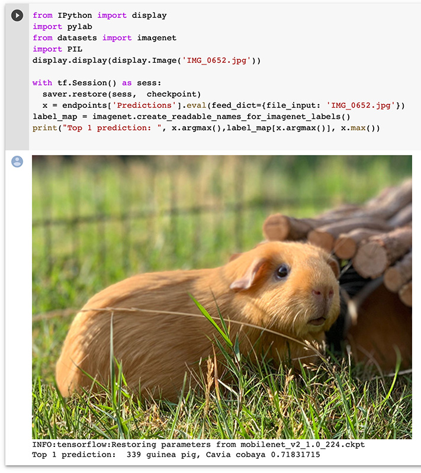

## Neural Style Transfer with tf.keras

In this next exploration, we'll run a Style Transfer model. A Style Transfer model applies the "style" of one component to another component. This can be images, but could also be sound (e.g. music).

Do a search for "Neural Style" on https://aihub.cloud.google.com/. You'll find a couple of notebooks. We'll work with the ["Neural Style Transfer with tf.keras" notebook](https://aihub.cloud.google.com/u/0/p/products%2F7f7495dd-6f66-4f8a-8c30-15f211ad6957). 

Note: some blocks can take quite a while to run (such as the blocks calling into `run_style_transfer`)! Be patient 🙂. Go through the notebook up until "Try it on other images"

### Try it on other images

In the "Try it on other images" section you can see a couple of code blocks loading an image and style image. Let's try using an image of our own.

Open the file explorer and click on the two dots to navigate one level up:

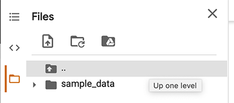

Navigate to /tmp/nst and rightclick that nst folder. Choose upload and upload a photo of your own:

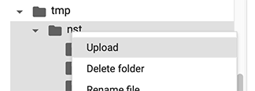

Change one of the example blocks and try stylizing an image of your own!

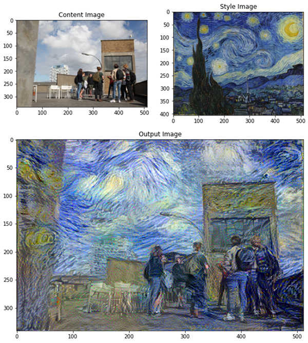

## Train and convert in the cloud: QuickDraw

As a next project, we'll train a model on a cloud GPU, and convert it for usage in Tensorflow.js.

[Zaid Alyafeai](https://twitter.com/zaidalyafeai) has created a [medium post, walking you through the necessary steps to create a QuickDraw recognizer](https://medium.com/tensorflow/train-on-google-colab-and-run-on-the-browser-a-case-study-8a45f9b1474e). Following along with that online guide, which will take you through the necessary steps on Google Colab and provides some Tensorflow.js snippets.

At time of writing we ran into one little issue in the "The Model" section:

> module 'tensorflow._api.v2.train' has no attribute 'AdamOptimizer'

Look for the line `adam = tf.train.AdamOptimizer()` and replace it with `adam = tf.optimizers.Adam()`

Here's a starter html template, which has the drawing logic in place. Fill in the gaps, based on the walkthrough!

```html
<!DOCTYPE html>
<html lang="en">
<head>
  <meta charset="UTF-8">
  <meta name="viewport" content="width=device-width, initial-scale=1.0">
  <meta http-equiv="X-UA-Compatible" content="ie=edge">
  <title>QuickDraw</title>
  <style>
  body {
    background: #cccccc;
  }
  </style>
</head>
<body>
  <h1>Draw</h1>
  <canvas id="c" width="400" height="400"></canvas>
  <button id="btnReset">Clear Canvas</button>
  <ol id="result">
  </ol>
  <script src="https://cdnjs.cloudflare.com/ajax/libs/tensorflow/1.2.10/tf.min.js" integrity="sha256-HCgGF6GfUpPqCZc05QADRrfxnJ3UO1fqFJUZGx0U8Cc=" crossorigin="anonymous"></script>
  <script>
  {

    const $canvas = document.getElementById("c");
    const ctx = $canvas.getContext("2d");
    const $btnReset = document.getElementById('btnReset');
    const $result = document.getElementById('result');

    let model, classNames, mouseIsDown = false, coords = [];

    const init = async () => {
      // uncomment and correct the paths below
      // model = await tf.loadLayersModel('models/quickdraw/model.json');
      // classNames = (await (await fetch('models/quickdraw/class_names.txt')).text()).split("\n").filter(name => name.length > 0);

      $canvas.addEventListener('mousedown', startDrawing);
      $canvas.addEventListener('mousemove', draw);
      window.addEventListener('mouseup', stopDrawing);
      $btnReset.addEventListener('click', resetCanvas);

      resetCanvas();
    };

    const resetCanvas = () => {
      coords = [];
      ctx.fillStyle = 'white';
      ctx.fillRect(0, 0, $canvas.width, $canvas.height);
    };

    const startDrawing = e => {
      mouseIsDown = true;
      ctx.save();
      ctx.lineWidth = 10;
      ctx.beginPath();
      ctx.moveTo(e.offsetX, e.offsetY);
      coords.push({x: e.offsetX, y: e.offsetY});
    };

    const stopDrawing = e => {
      if (!mouseIsDown) {
        return;
      }
      mouseIsDown = false;
      ctx.closePath();
      ctx.restore();
      // todo: classify here
    };

    const draw = e => {
      if (!mouseIsDown) {
        return;
      }
      ctx.lineTo(e.offsetX, e.offsetY);
      ctx.stroke();
      coords.push({x: e.offsetX, y: e.offsetY});
    };

    init();

  }  
  </script>
</body>
</html>
```

## Other Colab projects

There are quite a few interesting ML projects you can run on Colab. Here's a couple of them you might want to try:

- Generate and edit photorealistic faces with StyleGAN - [Youtube: Face editing with Generative Adversarial Networks](https://www.youtube.com/watch?v=dCKbRCUyop8)
- Control a photo avatar using your webcam - [Github: Open Avatarify](https://github.com/alievk/avatarify)
- Text generation: [GPT-2 with javascript interface](https://colab.research.google.com/github/gpt2ent/gpt2colab-js/blob/master/GPT2_with_Javascript_interface_POC.ipynb)
- Create a cartoon version of yourself: [Toonify](https://www.justinpinkney.com/toonify-yourself/)

If you want to get a deeper understaning of Deep Learning networks, I highly recommend [taking a look at Jeff Heaton's course](https://github.com/jeffheaton/t81_558_deep_learning), which includes Colab notebooks and accompanying Youtube explainer videos.

## More on Tensorflow.js

- [Coding Traing Playlist: Introduction to TensorFlow.js - Intelligence and Learning](https://www.youtube.com/watch?v=Qt3ZABW5lD0&list=PLRqwX-V7Uu6YIeVA3dNxbR9PYj4wV31oQ)
- [Medium Post: A Gentle Introduction to TensorFlow.js](https://medium.com/tensorflow/a-gentle-introduction-to-tensorflow-js-dba2e5257702)

# RunwayML

[RunwayML](https://runwayml.com/) is an application which makes working with Machine Learning models a lot easier for creators. Instead of going through the work of configuring and installing a model on your machine (including all it's dependencies), it runs models in docker containers, locally or in the cloud. You can easely explore a model's capability using an intuitive desktop application, which even provides options to link models together.

Once you've familiarized yourself with a model, you can talk to the RunwayML application using sockets or http requests. This way you can write your own visual layer, which talks to the model through Runway behind the scenes.

Some models only run on the GPU, others support running them on your CPU. At this time, running GPU models locally (on your local docker install) only works on Linux with nvidea GPUs. Fear not if you don't have that configuration: there's also an option to run those models on a cloud GPU. You do need to pay for that usage though, and there's an additional delay communicating with that cloud GPU.

Go to https://runwayml.com/download/ to download the RunwayML desktop app. You'll also need to have Docker installed on your machine.

## Face-Landmarks

As a first example, we'll use the Face-Landmarks model.


This model enables you to detect face features (eyebrows, eyes, nose, mouth, ...). It's possible to run it on your local CPU, so you don't have to spend any cloud credits.

Get the model up and running within the RunwayML interface and explore it's configuration options.

> At time of writing, the latest Docker versions didn't work with RunwayML. If RunwayML keeps saying "Docker not available" even when you have Docker running, try downgrading to an older version (2.1.0.3 was working on my system - https://docs.docker.com/docker-for-mac/release-notes/)

### HTTP Fetch

RunwayML runs socket and HTTP endpoints, so you can talk to RunwayML from external apps. As a first, quick test, we'll call the HTTP endpoint from Javascript, as most of the code can be copy pasted from within RunwayML 😎

Create a new HTML file, and add a canvas and a script tag:

```html
<canvas id="c" width="640" height="480"></canvas>
<script>
</script>
```

Store the canvas and a 2d drawing context in a global variable:

```javascript
const canvas = document.getElementById('c');
const ctx = canvas.getContext('2d');
```

Open the Network tab in runway, and select Javascript. At the bottom, you'll see the code to fetch the data of the currently running model:


Copy that fetch code over, and log the points and labels:

```javascript
console.log(points, labels);
```

You should see a list of 72 points and labels in your console. The points are x/y pairs of relative values (values between 0 and 1):

```javascript
[[0.38666666666666666,0.4225],[0.39,0.4875],[0.395,0.55],[0.405,0.615],[0.4216666666666667,0.6725],[0.44666666666666666,0.72],[0.4816666666666667,0.7575],[0.5166666666666667,0.7875],[0.5566666666666666,0.7975],[0.5933333333333334,0.785],[0.6266666666666667,0.7525],[0.655,0.71],[0.6766666666666666,0.66],[0.69,0.6025],[0.6966666666666667,0.54],
// etc...
]
```

Use [`ctx.fillRect(...)`](https://developer.mozilla.org/en-US/docs/Web/API/CanvasRenderingContext2D/fillRect) to draw squares on the canvas. Make sure to multiply the relative point values by the canvas size to map them to canvas space...

```javascript
point[0] * canvas.width
```

Every time you refresh the page, you should see a simple visualization of the points coming from RunwayML:


### Socket.io

Polling the server through fetches isn't ideal. Luckely, RunwayML also runs a socket server we can connect to. This way we can get updates as they arrive.

If you click on "Socket.io" in the Runway Network tab, you'll see the Server address being `http://localhost:3000`. It also specifies the events the Socket server understands / emits. The event we'll use is the 'data' event, which will contain the points and labels.

Load socket.io in your html file, and create a connection to the RunwayML socket server:

```javascript
const socket = io.connect(`http://localhost:3000`);
```

Listen for the 'data' event on the socket, and add the render logic again to show the points on the canvas:

```javascript
socket.on('data', outputs => {
  const { points, labels } = outputs;
  // here be rendering code
});
```

When running the app, you should see the face points move as they get  pushed over the websocket connection:


### Creating a face cutout

The Face Landmarks data contains both coordinates and labels: you can combine this data to access a specific coordinate (e.g. get the position of a coordinate of the chin...).

We'll use this to create a cutout of the face, which you can integrate in another image.

First of all, let's combine the two arrays in the input data:

```javascript
if (outputs && outputs.labels && outputs.labels.length > 0) {
  const face = {};
  outputs.labels.forEach((label, index) => face[label] = outputs.points[index]);
  console.log(face);
}
```

The `face` object is now a key-value combination of the label (e.g. chin_0) with the corresponding coordinate (e.g [0.54, 0.66]).

```javascript
{
  "chin_0":[0.3933333333333333,0.16],
  "chin_1":[0.39166666666666666,0.1975],
  "chin_2":[0.39,0.2425],
  "chin_3":[0.39166666666666666,0.29],
  "chin_4":[0.3983333333333333,0.3375],
  "chin_5":[0.4116666666666667,0.3825],
  "chin_6":[0.435,0.4125],
  "chin_7":[0.465,0.4325],
  "chin_8":[0.5,0.44],
  "chin_9":[0.5383333333333333,0.44],
  "chin_10":[0.5766666666666667,0.43],
  "chin_11":[0.615,0.4075],
  "chin_12":[0.6416666666666667,0.3675],
  "chin_13":[0.6566666666666666,0.3175],
  "chin_14":[0.665,0.2625],
  "chin_15":[0.6716666666666666,0.205],
  "chin_16":[0.675,0.1525],
  "left_eyebrow_0":[0.4033333333333333,0.095],
  "left_eyebrow_1":[0.41,0.0525],
  "left_eyebrow_2":[0.43166666666666664,0.03],
  "left_eyebrow_3":[0.45666666666666667,0.025],
  "left_eyebrow_4":[0.48333333333333334,0.035],
  // etc...
}
```

Using this lookup object, draw an outline of the face, going from the chin coordinates, through the eyebrows:

```javascript
ctx.beginPath();
ctx.moveTo(face.chin_0[0] * $canvas.width, face.chin_0[1] * $canvas.height);
for (let i = 1; i < 17; i++) {
  ctx.lineTo(face['chin_' + i][0] * $canvas.width, face['chin_' + i][1] * $canvas.height);
}
// TODO: write 2 loops to go through the eyebrows
ctx.closePath();
ctx.stroke();
```

You should end up with an outline of your face on the screen:


Let's use this as a mask for our video. Add a video tag to your page, and display the webcam feed in that video tag. Once it works, use css to hide the element; because we will draw the video in the canvas.

Drawing video frames on a canvas, is as simple as using drawImage, passing in a reference to your (hidden) video tag:

```javascript
ctx.drawImage($video, 0, 0);
```

If you want to cut pixels out of the video, you can use the context `clip()` function, after you've created a shape (which we did: the face outline is a shape). Make sure to have a `ctx.save()` and `ctx.restore()` in place, otherwise you'll be clipping on top of previous clips, making the visible area smaller each render.

```javascript
ctx.save();

//
// your outline logic should be here
//

ctx.clip();
ctx.drawImage($video, 0, 0);
ctx.restore();
```

Test the code, you should see a masked version of your face.


Once you've got this up and running, try embedding it in another image?

## Sending an image to RunwayML - Few-Shot-Face-Translation

In the previous app, you ran the webcam as input in runway, and displayed it in the browser. The input (webcam) was configured in the RunwayML desktop app.

It's also possible to send a picture to Runway though an HTTP call. This way, you can create a custom interface in your own app, send an image from your app to Runway, to process it with a model and get the response back in your app. Let's test this with the Few-Shot-Face-Translation Model.

This model only runs on the GPU; you'll need to run it in the Runway Cloud, unless you've got a Linux Machine with a beefy nvidia GPU.

In the example javascript code, you see that it expects 2 base64 images as inputs:

```javascript
const inputs = {
  "source": "<base 64 image>",
  "target": "<base 64 image>"
};
```

You can create a base64 version of a canvas, by using the `canvas.toDataURL` method. Let's create a simple html file, with two canvasses for the inputs:

```html
<!DOCTYPE html>
<html lang="en">
<head>
  <meta charset="UTF-8">
  <meta name="viewport" content="width=device-width, initial-scale=1.0">
  <meta http-equiv="X-UA-Compatible" content="ie=edge">
  <title>Few Shot Face Translation</title>
  <style>
    .input-frames {
      display: flex;
    }
    .input-frame__canvas {
      width: 320px;
      height: 240px;
    }
  </style>
</head>
<body>
  <section>
    <h1>Input</h1>
    <div class="input-frames">
      <div class="input-frame">
        <canvas id="canvasA" class="input-frame__canvas" width="640" height="480"></canvas>
      </div>
      <div class="input-frame">
        <canvas id="canvasB" class="input-frame__canvas" width="640" height="480"></canvas>
      </div>
    </div>
  </section>
  <button id="btn">Process with Few Shot Face Translation</button>
  <script>
  {
    const $canvasA = document.getElementById('canvasA');
    const aCtx = $canvasA.getContext('2d');

    const $canvasB = document.getElementById('canvasB');
    const bCtx = $canvasB.getContext('2d');
    
    const $btn = document.getElementById('btn');
  }
  </script>
</body>
</html>
```

Access your webcam in the browser, setup a requestAnimationFrame loop and draw the webcam image to canvasA using the `aCtx.drawImage()` method.

Add an image to your project, with a clear image of a face. Resize it to 640x480 in advance to keep things simple. Draw that image to canvasB (again using `drawImage`).

Add an event listener to the button's click event. This is where you'll send the base64 encoded canvasses to RunwayML:

```javascript
const inputs = {
  "source": $canvasA.toDataURL('image/jpeg'),
  "target": $canvasB.toDataURL('image/jpeg')
};
```

Make sure the Runway Model is running (it might take a couple of minutes for the model to launch on the remote GPU), and implement the javascript fetch logic to send the inputs from the browser to input.

To display the base64 image from the response, you can use the base64 string as the `src` attribute on the image:

```javascript
const { result } = outputs;
const $outputImg = document.createElement('img');
$outputImg.src = result;
document.body.appendChild($outputImg);
```

# Other Resources

- [The Neural Aesthetic @ ITP-NYU :: 06 Generative models](https://www.youtube.com/watch?v=U_u5CuLGVSc)
- [Sónar+D Masterclasses 2019: The Limits of Learning, with Kyle McDonald](https://www.youtube.com/watch?v=kWvHjp8vifM)